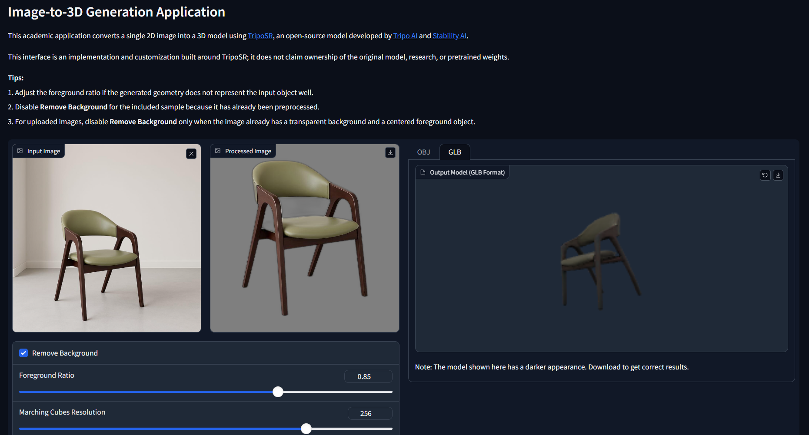

# Image-to-3D Generation Application

## Overview

This project is built using [TripoSR](https://github.com/VAST-AI-Research/TripoSR). It is an Image-to-3D Generation Application that converts a single 2D image into a 3D model through an interactive Gradio interface.

The application preprocesses the uploaded image, optionally removes its background, runs inference using the pretrained TripoSR model, extracts a 3D mesh, displays an interactive preview, and allows users to download the generated model in OBJ and GLB formats.
## My Contribution

My work in this repository is the implementation and customization of the application workflow around TripoSR. This includes:

- Integrating the pretrained TripoSR model into a Gradio application
- Implementing image upload and sample-image input
- Connecting background removal and foreground-resizing controls
- Adding configurable marching-cubes resolution
- Generating interactive 3D previews
- Exporting generated meshes in OBJ and GLB formats
- Organizing and documenting the project as a reproducible academic application

I do not claim ownership of TripoSR, its model architecture, original source code, research, training process, or pretrained weights.

## Features

- Generates a 3D mesh from one 2D image
- Supports uploaded images and an included sample image
- Provides optional automatic background removal
- Provides adjustable foreground scaling
- Provides configurable mesh-extraction resolution
- Displays generated models in an interactive viewer
- Exports OBJ and GLB files
- Uses CUDA when available and falls back to CPU otherwise

## Technologies Used

- Python
- PyTorch
- TripoSR
- Gradio
- Hugging Face Hub
- Transformers
- Pillow
- NumPy
- rembg
- trimesh
- torchmcubes

## Installation

### Prerequisites

- Python 3.8 or newer
- Git
- Internet access on the first run to download the pretrained model files
- A CUDA-compatible NVIDIA GPU is recommended for faster generation; CPU execution is supported but slower

### Setup

1. Clone the repository:

   ```bash
   git clone https://github.com/AsimAslah/Image-to-3D.git
   cd Image-to-3D
   ```

2. Create a virtual environment:

   ```bash
   python -m venv .venv
   ```

3. Activate the virtual environment.

   Windows PowerShell:

   ```powershell
   .\.venv\Scripts\Activate.ps1
   ```

   macOS or Linux:

   ```bash
   source .venv/bin/activate
   ```

4. Upgrade the Python packaging tools:

   ```bash
   python -m pip install --upgrade pip setuptools wheel
   ```

5. Install PyTorch using the command recommended for the operating system and CUDA version in the [official PyTorch installation guide](https://pytorch.org/get-started/locally/).

6. Install the remaining dependencies:

   ```bash
   pip install -r requirements.txt
   ```

## How to Run

Start the application:

```bash
python app.py
```

Open `http://127.0.0.1:7860` in a browser. Upload an image or select the included chair image, adjust the preprocessing and resolution settings, and select **Generate 3D Model**.

Optional launch commands:

```bash
# Run on a different port
python app.py --port 8080

# Allow access from other devices on the network
python app.py --listen

# Create a temporary Gradio sharing link
python app.py --share

# Enable basic authentication
python app.py --username admin --password your-password
```

The first launch downloads the TripoSR configuration and pretrained weights from the [`stabilityai/TripoSR`](https://huggingface.co/stabilityai/TripoSR) Hugging Face repository.

## Project Structure

```text
Image-to-3D/
|-- app.py                       # Gradio application and Image-to-3D workflow
|-- assets/
|   `-- screenshots/             # Verified application result screenshots
|-- examples/
|   `-- chair.png                # Sample input image
|-- sample_outputs/
|   |-- chair.obj                # Generated chair mesh in OBJ format
|   `-- chair.glb                # Generated chair model in GLB format
|-- tsr/                         # Required TripoSR inference source
|   |-- models/                  # Tokenizers, transformer, renderer, and mesh extraction
|   |-- system.py                # Model loading, inference, and mesh generation
|   `-- utils.py                 # Image preprocessing and application utilities
|-- requirements.txt             # Python dependencies
|-- LICENSE                      # Original TripoSR MIT license
|-- .gitignore                   # Generated-file and environment exclusions
`-- README.md                    # Project documentation
```

The `tsr/` directory is retained because the downloaded TripoSR configuration imports these modules directly during model initialization. The pretrained configuration and weights are downloaded at runtime and are not stored in this repository.

## Output

The application produces:

- A processed-image preview
- An interactive 3D model preview
- A downloadable OBJ model
- A downloadable GLB model

### Chair Example

The following screenshots show the same chair image after preprocessing and generation at a marching-cubes resolution of 256.

**OBJ result**


**GLB result**



Download the verified sample outputs:

- [Chair OBJ model](sample_outputs/chair.obj)
- [Chair GLB model](sample_outputs/chair.glb)

The two sample files above are retained as portfolio evidence. Other generated model files remain excluded from version control.

## Future Improvements

- Add automated tests for preprocessing and mesh export
- Add more verified examples for different object categories
- Add clearer model-download and hardware error messages
- Add generation progress feedback
- Add a reproducible container configuration

## Attribution

This project is built using the open-source [TripoSR](https://github.com/VAST-AI-Research/TripoSR) implementation and the pretrained [`stabilityai/TripoSR`](https://huggingface.co/stabilityai/TripoSR) model.

TripoSR was developed by [Tripo AI](https://www.tripo3d.ai/) and [Stability AI](https://stability.ai/). The retained TripoSR source is distributed under the MIT License in [LICENSE](LICENSE), which preserves the original copyright notice:

> Copyright (c) 2024 Tripo AI & Stability AI

This repository presents my academic application-level integration and customization. It does not claim ownership of the TripoSR model, research, pretrained weights, or original implementation.
